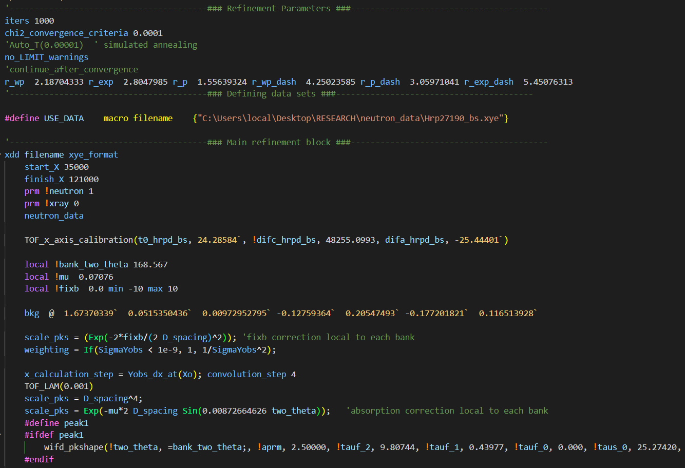

# TOPAS Language Support for VS Code

This extension provides **syntax highlighting**, **language support**, and **basic features** for the TOPAS language, commonly used in crystallography and material science, directly within **Visual Studio Code**.

## Features

- **Syntax highlighting** for `.inp`, `.out`, and `.inc` files.
- **Highlighting support** for:
  - Keywords
  - Functions
  - Variables
  - Operators
  - Comments
  - Local Macros

## File Types Supported

- **.inp**: Input files for TOPAS
- **.out**: Output files generated by TOPAS
- **.inc**: Include files for additional macros

## Future Updates - Works in Progress

- **Dynamic Macro Highlighting:** Right-click on a macro name to add it to the syntax highlighting rules dynamically.
- **Snippets:** insertable common code blocks for constructing TOPAS input files, similar to the old JEdit Xinsert plugin. 
- **Import CIF:** parse CIF files and format data for running in TOPAS
- **Send to TOPAS:** Launch TOPAS from VS Code and load active .inp file for refinement. 

## Dark & Light Color Themes
- Easily switch color themes
  - `Ctrl` + `Shift` + `p`  to bring up command box
  - type `theme` 
  - select `Prefernces: Color Theme` and choose your preferred theme

**Topas Dark**

**Topas Light**

**VS Code Dark Modern**

## Installation

1. Download and install the extension from the **Visual Studio Code Marketplace**.
2. Once installed, the extension will automatically apply to `.inp`, `.out`, and `.inc` files.

## Usage

### Syntax Highlighting

Open any `.inp`, `.out`, or `.inc` file to see the syntax highlighting applied. The following elements are highlighted:

- **Comments**: Block and line comments are highlighted.
- **Keywords**: Common TOPAS control keywords are supported, such as `prm`, `local`, `global`, etc.
- **Functions**: Functions like `Abs`, `Sin`, `Cos`, etc., are highlighted.
- **Operators**: All mathematical and logical operators are supported.
- **Macros**: Macros defined with the `macro` keyword will be highlighted.

## Contributing

Feel free to contribute by reporting issues or suggesting features. You can clone the repository and submit a pull request on GitHub.

## Release Notes

### 1.0.0

- Initial release with syntax highlighting for `.inp`, `.out`, and `.inc` files.

---

**Enjoy using TOPAS Language Support in VS Code!**
